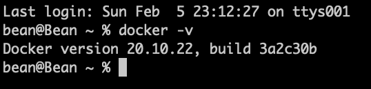

# 1. Docker 설치

### 참조 자료 링크

> - [Docker](https://www.docker.com/)

###### Download 눌러 설치 파일 받기

</img>

###### 다운 받은 dmg 파일 실행 후 Applications로 복사

</img>

###### Dashboard 실행하여 설치 상태 확인

</img>

###### 설치 후 Docker 버젼 확인

</img>

```
    docker -v
```

---

### YouTube Link

> * [Docker Install](https://youtu.be/jBVTQf_tJj0)

---

### Table of Contents

###### [0. Docker 알아보기](../../../../)

#### 1. Docker 설치

###### [2. Docker 기본 명령어](../2.docker/)

###### [3. Docker 실행(Run)](../3.docker/)

###### [4. Docker File 만들기](../4.docker/)

###### [5. Docker File 빌드하기](../5.docker/)

###### [6. Docker Compose 기본 명령어](../6.docker/)

###### [7. Docker Compose 만들기](../7.docker/)

###### [8. Docker Compose 실행(Run)](../8.docker/)

###### [9. DevContainer 알아보기](../9.docker/)

###### [10. DevContainer를 이용한 HTTP Web Server 환경 만들기](../10.docker/)

###### [11. DevContainer를 이용한 Database 환경 만들기](../11.docker/)

###### [12. DevContainer를 이용한 Web Application Server 환경 만들기](../12.docker/)

###### [13. DevContainer를 이용한 Developer Server 환경 만들기](../13.docker/)
