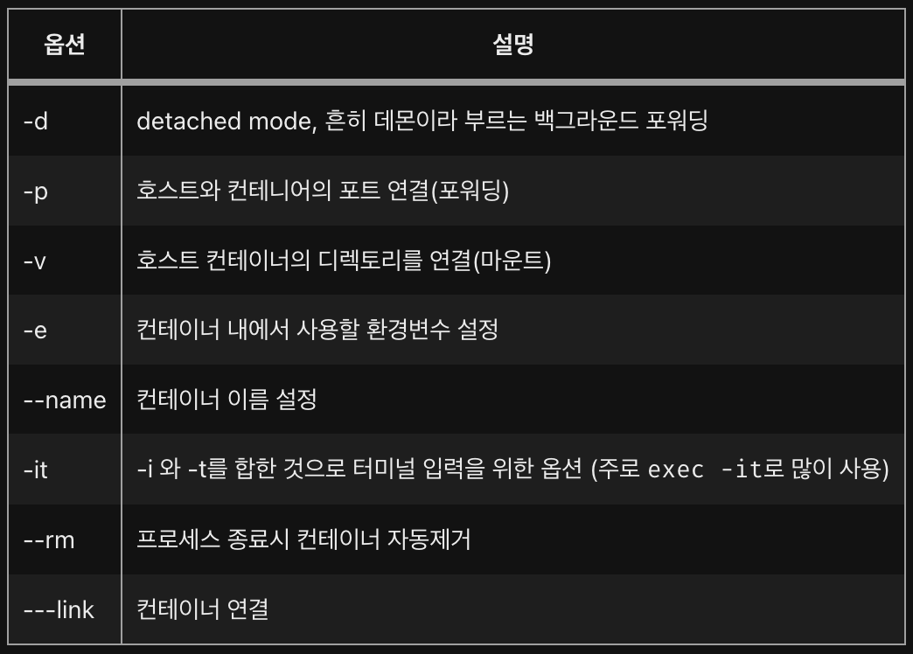

# 2. Docker 기본 명령어

### Docker CLI 명령어

* 현재 실행 중인 Docker 버젼 확인
```
docker --version
docker -v
```
* Docker 명령어 출력
```
docker --help
```
* Docker Hub에 있는 Repository의 이미지를 내려받기
```
docker pull [이미지명:태그명]
docker pull ubuntu:latest
```
* Docker Container 생성
```
docker run [옵션] [컨테이너명] [도커 이미지]
docker run -it -d --name ubuntu ubuntu:latest
```
* 실행 된 Docker Container 목록 출력
```
docker ps
```
* 실행 또는 정지 된 Docker Container 목록 출력
```
docker ps -a
```
* 실행 된 Docker Container에서 CLI 명령어 사용
```
docker exec [옵션] [컨테이너 이름] [CLI 명령어]
docker exec -it [컨테이너 이름] bash
```
* 실행 된 Docker Container 정지
```
docker stop [컨테이너 이름]
```
* 실행 된 Docker Container 강재 정지
```
docker kill [컨테이너 이름]
```
* 로컬에 있는 Docker Container를 Image로 만들기
```
docker commit [컨테이너 이름] [사용자명/이미지명]
```
* Docker Hub Repository에 로그인 할때 사용
```
docker login
```
* Docker Hub Repository에 이미지를 올릴때 사용
```
docker push [사용자명/이미지명]
```
* 로컬에 저장된 Docker Image 목록
```
docker images
```
* 정지된 Docker Container를 지울 때 사용
```
docker rm [컨테이너 ID]
docker rm --force [컨테이너 ID]
docker rm -f $(docker ps -aq)
```
* 로컬에 있는 Docker Image를 지울 때 사용
```
docker rmi [이미지명]
docker rmi $(docker images -q)
```
* 선택한 Docker File를 빌드하기 위해 사용
```
docker build [Psth to Dockerfile]
```

### Docker CLI Option

</img>

---

### Table of Contents

###### [0. Docker 알아보기](../../../../)

###### [1. Docker 설치](../1.docker/)

#### 2. Docker 기본 명령어

###### [3. Docker 실행(Run)](../3.docker/)

###### [4. Docker File 만들기](../4.docker/)

###### [5. Docker File 빌드하기](../5.docker/)

###### [6. Docker Compose 기본 명령어](../6.docker/)

###### [7. Docker Compose 만들기](../7.docker/)

###### [8. Docker Compose 실행(Run)](../8.docker/)

###### [9. DevContainer 알아보기](../9.docker/)

###### [10. DevContainer를 이용한 HTTP Web Server 환경 만들기](../10.docker/)

###### [11. DevContainer를 이용한 Database 환경 만들기](../11.docker/)

###### [12. DevContainer를 이용한 Web Application Server 환경 만들기](../12.docker/)

###### [13. DevContainer를 이용한 Developer Server 환경 만들기](../13.docker/)

