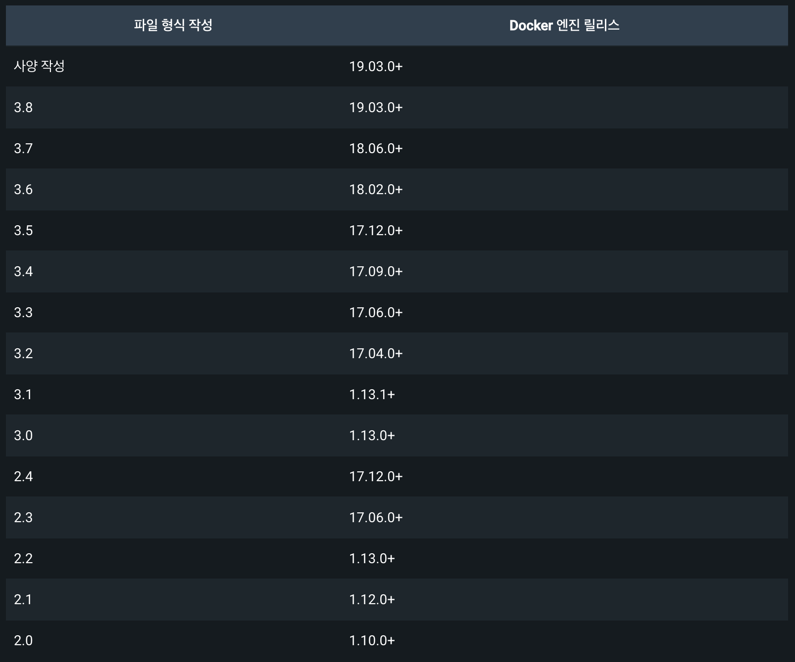

# 6. Docker Compose 기본 명령어

### Compose 버젼 확인

```
docker-compose -v
```

### Compose yml 구성

> [Compose Version](https://docs.docker.com/compose/compose-file/compose-versioning/)

```version:``` > yml 파일 포맷의 버젼을 나타내며, 도커 컴포지 버젼은 도커 엔진 버젼에 의존성이 있으므로 가능하면 최신 버젼을 사용하는 것이 좋다.

</img>

> [Compose Services](https://docs.docker.com/compose/compose-file/05-services/)

```services:``` > 생성될 컨테이너들을 묶어놓은 단위이며, 서비스 항목 아래에는 각 컨테이너에 적용될 생성 옵션을 지정합니다.

> [Compose Networks](https://docs.docker.com/compose/compose-file/06-networks/)

```networks:``` > default 네트워크를 생성하고 모든 컨테이너를 연결하는데 사용됩니다.

```
version: "3"
services:
  web:
    image: nginx:latest
    ports:
      - "8080:80"
    networks:
      - default
      - new_net
networks:
  new_net:
    driver: bridge
```

- ```docker network ls```로 네트워크 이름 목록을 확인가능합니다.
- ```docker network inspect bridge```로 상세정보를 확인가능합니다.

> [Compose Volumes](https://docs.docker.com/compose/compose-file/07-volumes/)

```volumes:``` > 두개 이상의 컨테이너에서 파일 경로를 공유하기 위하여 사용합니다.

```
version: "3"
services:
  nodejs:
    image: node:latest
    volumes:
      - shared-data:/usr/src/app
  db:
    image: mariadb:latest
    volumes:
      - shared-data:/usr/src/mysql
    ports:
      - “3306:3306”
volumes:
  shared-data:
```

- ```shared-data```는 임의로 지정한 이름이며 원하시는데로 이름 변경이 가능 합니다.

> [Compose Configs](https://docs.docker.com/compose/compose-file/08-configs/)

```configs:``` > 속성에 의해 명시적으로 부여된 경우에만 구성에 액세스할 수 있습니다.

- ```file```: 지정된 경로에 있는 파일의 내용으로 구성이 생성됩니다.
- ```environment```: 환경 변수 값으로 구성 콘텐츠가 생성됩니다.
- ```content```: 인라인된 값으로 콘텐츠가 생성됩니다.
- ```external```: true로 설정된 경우 external이 구성이 이미 생성되었음을 지정합니다. Compose는 생성을 시도하지 않으며 존재하지 않는 경우 오류가 발생합니다.
- ```name```: 조회할 컨테이너 엔진의 구성 개체 이름입니다. 이 필드는 특수 문자가 포함된 구성을 참조하는 데 사용할 수 있습니다. 이름은 그대로 사용되며 프로젝트 이름으로 범위가 지정되지 않습니다.

> [Compose Secrets](https://docs.docker.com/compose/compose-file/09-secrets/)

```secrets:``` > 속성에 의해 명시적으로 부여된 경우에만 비밀에 액세스할 수 있습니다.

- ```file```: 지정된 경로에 있는 파일의 내용으로 비밀이 생성됩니다.
- ```environment```: 보안 비밀은 환경 변수 값으로 생성됩니다.
- ```external```: true로 설정된 경우 external이 비밀이 이미 생성되었음을 지정합니다. Compose는 생성을 시도하지 않으며 존재하지 않는 경우 오류가 발생합니다.
- ```name```: Docker의 비밀 객체 이름입니다. 이 필드는 특수 문자가 포함된 비밀을 참조하는 데 사용할 수 있습니다. 이름은 있는 그대로 사용되며 프로젝트 이름으로 범위가 지정되지 않습니다.

---

### Table of Contents

###### [0. Docker 알아보기](../../../../)

###### [1. Docker 설치](../1.docker/)

###### [2. Docker 기본 명령어](../2.docker/)

###### [3. Docker 실행(Run)](../3.docker/)

###### [4. Docker File 만들기](../4.docker/)

###### [5. Docker File 빌드하기](../5.docker/)

#### 6. Docker Compose 기본 명령어

###### [7. Docker Compose 만들기](../7.docker/)

###### [8. Docker Compose 실행(Run)](../8.docker/)

###### [9. DevContainer 알아보기](../9.docker/)

###### [10. DevContainer를 이용한 HTTP Web Server 환경 만들기](../10.docker/)

###### [11. DevContainer를 이용한 Database 환경 만들기](../11.docker/)

###### [12. DevContainer를 이용한 Web Application Server 환경 만들기](../12.docker/)

###### [13. DevContainer를 이용한 Developer Server 환경 만들기](../13.docker/)

